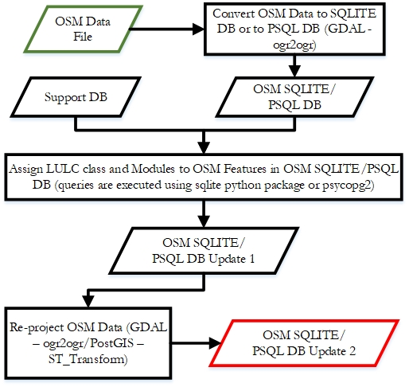
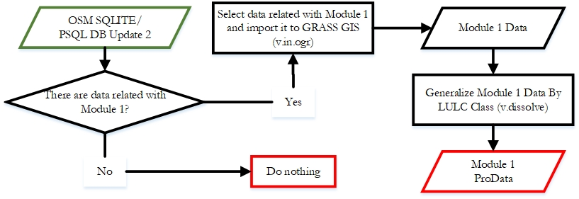
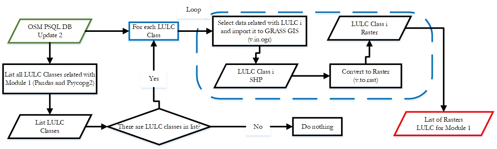
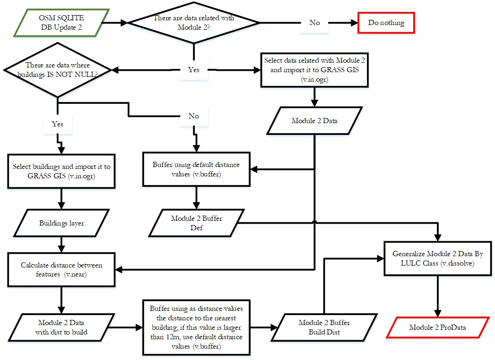
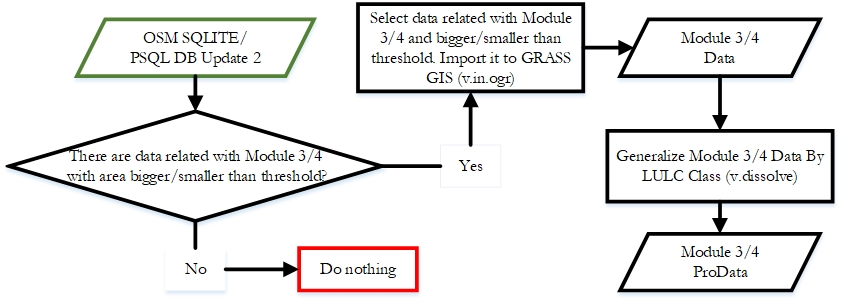
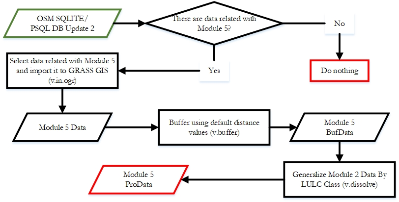
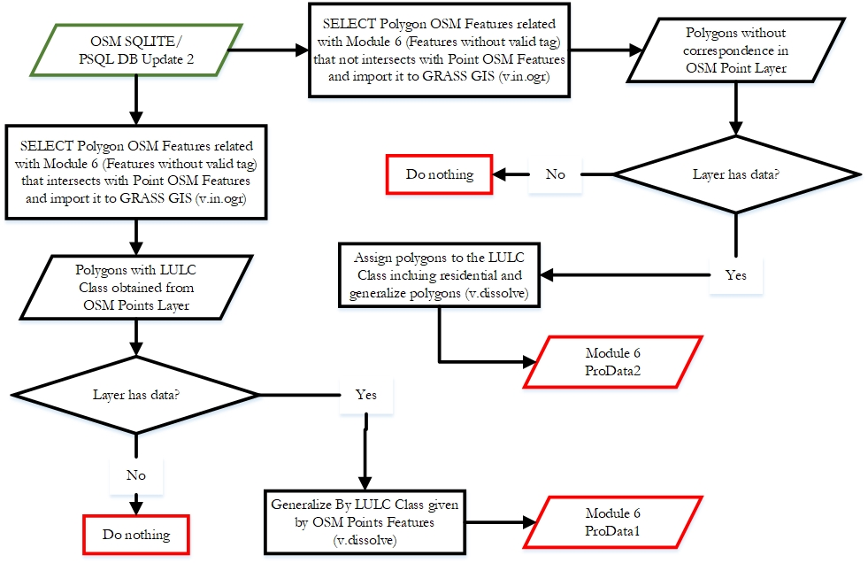
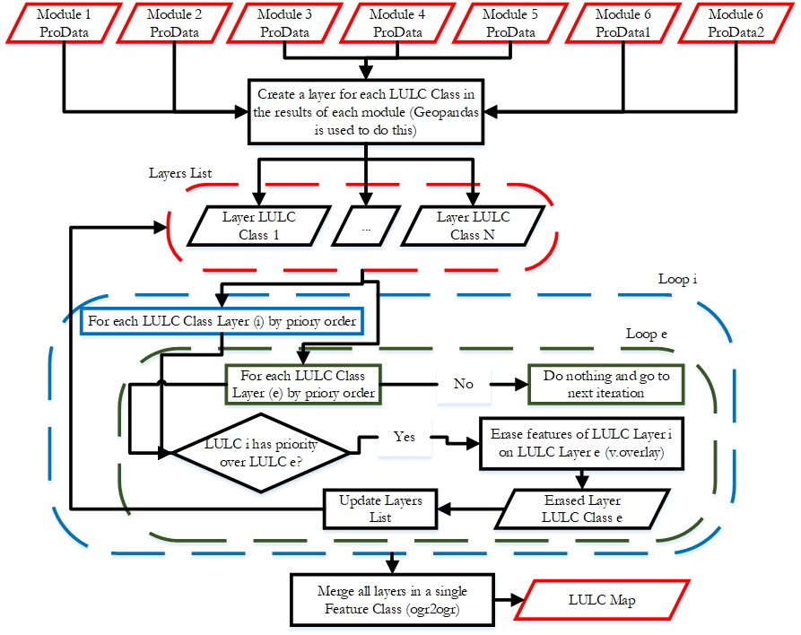
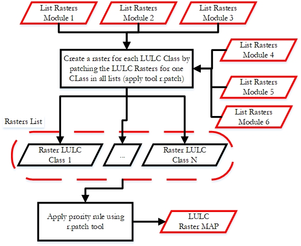
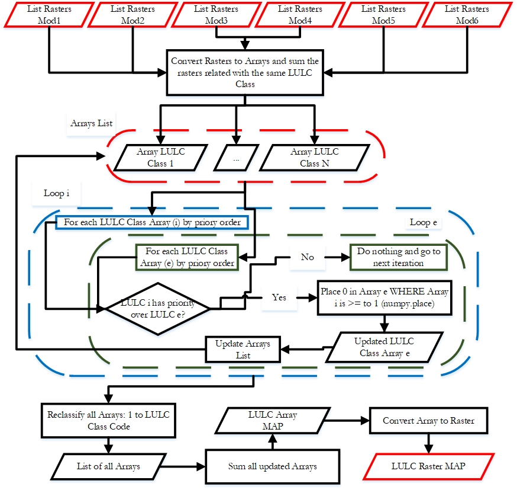

OSM2LULC Documentation
====================

OSM2LULC sub-package is based on a chain of logical procedures for the derivation of Land Use/Land Cover (LULC) maps from OpenStreetMap (OSM) data. OSM2LULC may be used to convert a file with raw OSM data into a LULC layer with one of the following nomenclatures:
- Urban Atlas (level 2);
- Corine Land Cover (level 2);
- Globe Land 30.

Currently, OSM2LULC has 4 versions:
- Version 1.1 (produce LULC map using only vector data; obsolete);
- Version 1.2 (produce LULC map using only vector data; faster than Version 1.1);
- Version 1.3 (produce LULC map using vector and raster data; LULC map is raster; obsolete);
- Version 1.4 (produce LULC map using vector and raster data; LULC map is raster; faster than other versions).

All developed versions implement the same logic rules to convert OSM to LULC. The differences between them are only procedural relating:
- each version uses tools from different GIS Software;
- results aggregation into a single layer is done differently from version to version.

[osm2lulc.ipynb](/gasp/osm2lulc/osm2lulc.ipynb) shows how different versions can be used!

OSM2LULC Workflow
====================

OSM2LULC is constituted by six modules and one procedure to merge the results of the six modules into the same layer (PRIORITY RULE).

##### Pre-processing applied to OSM data: #####

##### MODULE 1 Workflow: #####

Version 1.1 and 1.2:

Version 1.3:

Version 1.4:

Version 1.4 is very similar to 1.3 with differences only in two aspects: 1) for the selection and export of OSM features associated with MODULE 1, GRASS GIS v.in.ogr tool is replaced by GDAL ogr2ogr; and 2) the conversion to raster is performed by a program that implements Python API methods of GDAL library (https://pcjericks.github.io/py-gdalogr-cookbook/, accessed March 10, 2019).

##### MODULE 2 Workflow: #####

Version 1.1:

Version 1.2:

In terms of performance, this module revealed to be more time-consuming in Version 1.1, mainly due to the tasks related to calculating distances between lines and buildings (GRASS GIS tool). PostGIS was the option selected to replace GRASS GIS in MODULE 2 (i.e. in this type of operations) because it allowed the acceleration of tasks related to calculating minimum distances between geographic entities. As a result, MODULE 2 workflow has undergone changes and assumes the scheme presented in next Figure, which, comparing to the scheme of the last figure, presents only differences in the tools used (i.e. the replacement of GRASS GIS by PostGIS) and the environment in which the processing occurs (i.e. performed using a PostgreSQL database).

Version 1.3 and 1.4:

In the execution of tasks associated with MODULE 2, PostgreSQL/PostGIS presents a great efficiency, such that in Versions 1.3 and 1.4, the workflow is identical to that depicted in Figure of Version 1.2, with only one difference: in Version 1.3, the vector layer "Module2 ProData" is converted to raster data, using GRASS GIS "v.to.rast" tool; in Version 1.4, the same layer is not imported into GRASS GIS, but rather exported to ESRI Shapefile to be converted to raster using the GDAL/OGR library.

##### MODULE 3 and 4 Workflow: #####

Version 1.1 and 1.2:

Version 1.3 and 1.4:

This workflow was implemented as it is in versions 1.1 and 1.2. In versions 1.3 and 1.4, the v.dissolve tool was replaced by the conversion to a matrix data model (v.to.rast in Version 1.3 and GDAL/OGR in Version 1.4), and similarly to MODULE 2, the conversion to raster was performed in an iterative manner, generating a raster per class of LULC with the presence and absence of the same.

##### MODULE 5 Workflow: #####

Version 1.1 and 1.2:

Version 1.3 and 1.4:

In Versions 1.3 and 1.4, the aggregation of polygons using the v.dissolve tool was replaced by the conversion to the matrix data model in the same way as described for MODULES 3 and 4.

##### MODULE 6 Workflow: #####

Version 1.1 and 1.2:

Version 1.3 and 1.4:

Again, in Versions 1.3 and 1.4, the aggregation task with v.dissolve is overridden by the conversion to raster (v.to.rast in V 1.3; GDAL Python Bindings are used in V 1.4).

##### Agregation of results from each Module - Priority RULE Workflow: #####

Version 1.1 and 1.2:

Version 1.3:

Version 1.4:

